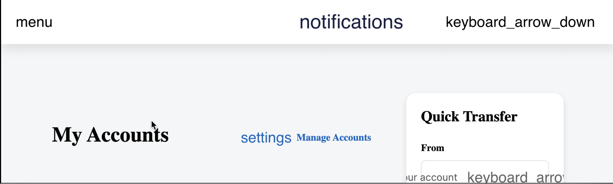
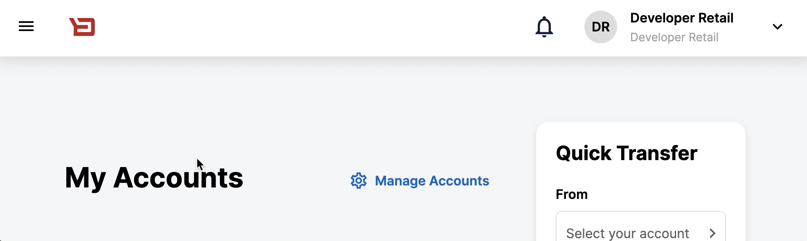

# The "Ask"
There are times where Icon fonts do not load in time before used in the application. This causes disruption for the User Interface, showing "text" as a replacement, until the font loads. We can initialize all icon fonts during startup. 



vs 



# How it works
The solution preloads selected fonts during the application startup. A developer is able to add fonts and update configuration to have those fonts preloaded in order to avoid icon names or misformatted text to appear briefly on the screen.  

# How to add to a project

1. Update TypeScript defenitions in `./tsconfig.base.json`.
   
   Add `es2021` to `lib` array:

   ```
   "lib": ["es2021", "dom"],
   ```
2. Install types for @types/css-font-loading-module

    `npm install -save -dev @types/css-font-loading-module`

3. Import `FontsLoaderModule` and `FontsLoaderConfigurationToken` in `src/app/app.module.ts`.

4. Add a font. "Material Icons" and "Material Icons Outlined" fonts are included OOTB, but the developer can add any other font to the application. For instance "IcoMoon":

    a. Copy font files into project's assets folder, for example:

    `src/assets/fonts/IcoMoon/icomoon.ttf `

    b. A font-face for the desired font has to be added to the application's stylesheet:
   
   ```
   @font-face {
        font-family: "IcoMoon";
        font-style: normal;
        font-weight: 400;
        src: url("assets/fonts/IcoMoon/icomoon.ttf") format("truetype");
    }
    ```

5. Add custom configuration in `src/app/app.module.ts` into `providers` aray which lists fonts to preload:

```
    {
      provide: FontsLoaderConfigurationToken,
      useValue: { fonts: [{ family: 'Material Icons Outlined' }, { family: 'Material Icons' }, { family: 'IcoMoon' }] },
    },
```

6. Restart the app.

7. Check the browser's console "Network" tab for loaded fonts.

`!` Text in the "family" field must match the font-face family name.

# Harvested Code
[Google Drive link](https://drive.google.com/drive/u/0/folders/1IlToe3g8exjr_EWM1hTxHdMqMTO96Iy2)
