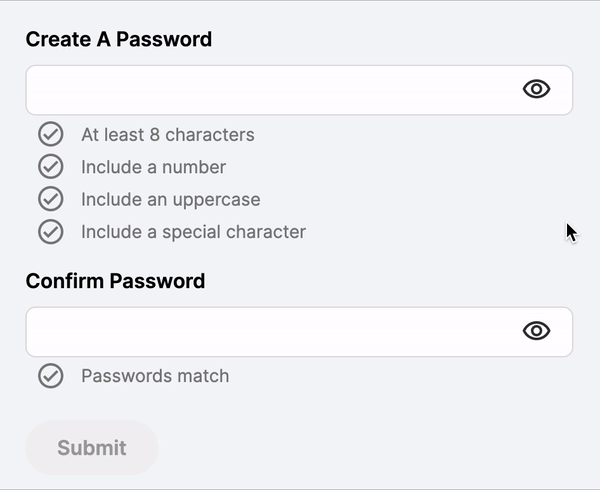

# The "Ask"
Create a "New Password" component that supports custom configurable password requirements. 




# How it works
The component can be put into a Formly form and provided a custom configuration that satisfies project requirements.
The coponents accept the following configuration parameters:
 - list of custom validators
 - icon name  

# How to add to a project

1. Create a component that contains a Formly form. This will be the form that supports functionality of your journey.

2. In the form's module import `InputNewPasswordComponent` and a module containing the component (i.e. `CustomUiModule`) to your journey:
    ```
    import { CustomUiModule, InputNewPasswordComponent } from '@backbase/custom-ui';
    ```

3. Add your Formy configuration with `FormlyModule.forChild()`.
    
    Along with other componets, add the "New Password" component into `types` array of the Formly configuration:
    ```
    imports: [
        FormlyModule.forChild({
        types: [
            {
                name: 'new-password',
                component: InputNewPasswordComponent,
            },
        ],
    ...
    ```

    Add your custom validators into `validators` array:
    ```
    imports: [
        FormlyModule.forChild({
        validators: [
            { name: Validation.PasswordMinLength, validation: passwordsMinLengthValidator },
            { name: Validation.PasswordHasNumber, validation: passwordHasNumberValidator },
            { name: Validation.PasswordHasUppercase, validation: passwordHasUppercaseValidator },
            { name: Validation.PasswordHasSpecialCharacter, validation: passwordHasSpecialCharacterValidator },
            { name: Validation.PasswordsMatch, validation: passwordsMatchValidator },
    ...
    ```
4. Import `InputNewPasswordConfiguration` and `InputNewPasswordConfigurationToken`:
    ```
    import { InputNewPasswordConfiguration, InputNewPasswordConfigurationToken } from '@backbase/custom-ui';
    ```
5. Provide configuration for "New Password" component with `InputNewPasswordConfigurationToken` in the "providers" array:

    ```
      providers: [
        {
        provide: InputNewPasswordConfigurationToken,
        useValue: <InputNewPasswordConfiguration>{
            requirementIcon: 'success',
            validators: [
                {
                    label: $localize`At least 8 characters`,
                    name: Validation.PasswordMinLength,
                    validation: passwordsMinLengthValidator,
                },
                {
                    label: $localize`Include a number`,
                    name: Validation.PasswordHasNumber,
                    validation: passwordHasNumberValidator,
                },
                {
                    label: $localize`Include an uppercase`,
                    name: Validation.PasswordHasUppercase,
                    validation: passwordHasUppercaseValidator,
                },
                {
                    label: $localize`Include a special character`,
                    name: Validation.PasswordHasSpecialCharacter,
                    validation: passwordHasSpecialCharacterValidator,
                },
                {
                    label: $localize`Passwords match`,
                    name: Validation.PasswordsMatch,
                    validation: passwordsMatchValidator,
                    confirm: true,
                },
            ],
            },
        },
      ]
    ```  

`requirementIcon` - the icon that displays agains every password requirement.
  
`validator` item in the `validators` array has the following attributes:

- `label` - password requirement text.  (add `$localize` tag if you would like the label be translated)
- `name` - name of your validator. Corresponds to the value provided to "FormlyModule.forChild" configuration.
- `validation` - reference to your custom validator
- `confirm` - If `true`, sets the component into "confirm" mode. This mode is used for the second instance of the component in the form for password confirmation. Default=`false`


`!` Custom validators are provided by a developer and are not part of the component package.