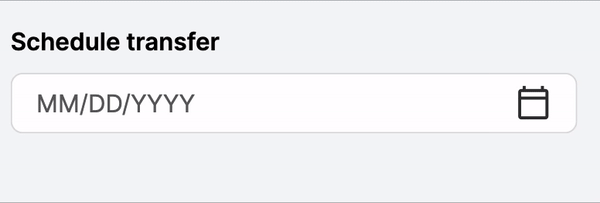

# The "Ask"
We wish to add masking to the DesignSystem datepicker. There is a npm package that implements a simple pattern solution.

This solution is different compared to the other ngx-mask implementation. We have to target ngModelChange



# How it works
The solution is a directive that adds input masking functionaliy to the OOTB datepicker UI component. While user types in the input element, the mask is being applied to the typed text, filtering out all not suported characters. 
Date range and split date range modes are supported.

We use [ngx-mask](https://github.com/JsDaddy/ngx-mask) pipe to transform the dare value.

# How to add to a project

1. Import two modules `InputDatepickerModule` and `MaskedDatepickerInpuModule`.

3. Add `bbMaskedDatepickerInput` directive attribute to your datepicker component:

```
<bb-input-datepicker-ui
    bbMaskedDatepickerInput
    [inputMask]="'00/00/0000'"
    [overrideDateFormat]="'MM/dd/yyyy'"
    label="Schedule transfer"
    [(ngModel)]="testModel"
    [rangeSelection]="false"
    [rangeSelectionSplit]="false"
    >
</bb-input-datepicker-ui>
```

3. Define input mask as value of the  `inputMask` attribute
4. Define the date format in `overrideDateFormat` attribute. Supported date formats are outlined [here](https://designsystem.backbase.com/v2/web-components/input-datepicker/web#_properties)

`!` Please note that date format and input mask has to match 


# Harvested Code
[Google Drive link](https://drive.google.com/drive/u/2/folders/1n774E8-mszlQiSr-7X5ZzLIdU4pNlVF-)
